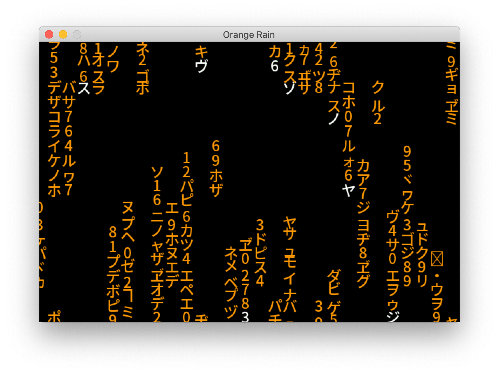

# Matrix Digital Rain
A simple recreation of the digital rain sequence from the Matrix, based on this tutorial from the [Coding Train](https://www.youtube.com/watch?v=S1TQCi9axzg) YouTube channel, but written in Python with PyGame.

More to come soon...

